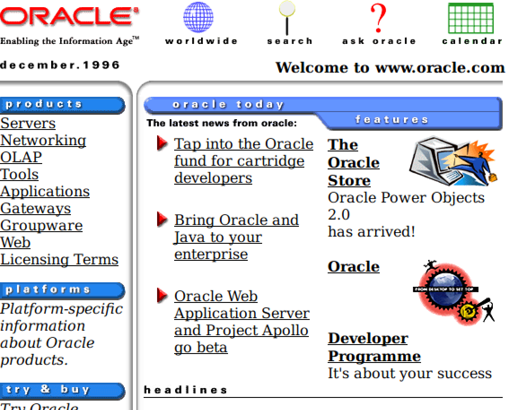

name: title
class: middle, center

# TypeScript
Seminar Skriptsprachen
<br>
Universität Kassel
<br>
**Niklas Mollenhauer** &lt;niklas@uni-kassel.de&gt;

???
- Fragen können gerne mittem im Vortrag gestellt werden
- Von mir gibt es zwei kleine Vorträge
- **Umfrage**: Wer hat schon mal was mit TS gemacht?
- **Umfrage**: Mit JS?

- **Bevor wir zu TS kommen, erstmal JS!!**
- **Wir werden dann sehen, was für Probleme JS für uns haben wird**

---
layout: true
.footer[Seminar Skriptsprachen — 12. November 2018]

---
class: middle, center
## Das Jahr 1995...
[Oracle]
???
- Webseiten sind statisch
- Äteres Bild konnte ich nicht finden

---
## Das Jahr 1995...
- Brendan Eich entwickelt eine Skriptsprache
- Soll vom Browser des Nutzers ausgeführt werden
- Zweck:
	- Formularvalidierung, bevor der Nutzer es absendet
	- Webseiten interaktiver machen
	- Zugriff auf Elemente innerhalb der Webseite
--

- Nach 10 Tagen der erste Prototyp
- **JavaScript ist geboren!**
- Einbau in Netscape Navigator
	- **80%** Marktanteil zu der Zeit

???
- BE: Späterer Gründer von Mozilla (den FF-Machern)
- Interaktiver machen: Button-Mouseover etc.

- Nannte man erst LiveScript/Mocha
	- JavaScript, weil: es gab Java

- Zum Vergleich:
	- Chrome ~60%
	- Firefox ~10-15%

---
## JavaScript
- Entworfen für simple Interaktionen
- **dynamisch**, **schwach** typisiert
- Im Mittelpunkt:
	- Funktionen
	- Prototypenbasierte Programmierung
- Mehrere Paradigmen möglich
	- Meist objektorientiert, funktional oder prozedural

???
- *dynamisch*, *schwach* typisiert
	- **Typische Skriptsprache**
- Prototypenbasierte Programmierung
	- Ähnlich wie wir es bei Ruby gesehen haben

---
## JavaScript
- Primitive Typen: `string`, `number`, `boolean`, ...
- `number`: Immer Fließkommazahl (vgl. `double` aus Java)
- Integer existieren nicht
--

- 2 Möglichkeiten für fehlende Werte: `null` und `undefined`
--

	- `undefined`: "Variable wurde nichts zugewiesen"
	- `null`: "Definiertes Nichts"
	- `undefined` kann trotzdem explizit zugewiesen werden

<!-- - TODO: Mehr zum Sprachdesign erzählen -->
<!-- - TODO: Typische Pitfalls zeigen, die jeder versteht -->
<!-- - TODO: Welche grundlegenden Konzepte unterstützt die Sprache? -->
<!-- - TODO: Wofür sind diese nützlich und wie werden sie verwendet? -->

???
- Im Gegensatz zu Ruby hat es prim. Typen
- **Umfrage**: Wer von Euch hat schon mal eine NPE bekommen?
- Könnt Euch vorstellen: `undefined`/`null` kann zu vielen Fehlern führen

- Weitere primitive Typen: `symbol`

---
## JavaScript — Sichtbarkeiten
- 2 verschiedne Arten von Sichtbarkeit
	- Block-Scoping
		- bekannt aus Java, C, ...
	- Function-Scoping
		- Eher typisch für Skriptsprachen
- Variablen können mit bestimmter Sichtbarkeit angelegt werden
	- Nur das Deklarationsschlüsselwort ist anders (`let`/`var`)

???
- Beispiel folgt auf der nächsten Folie

---
## JavaScript — Sichtbarkeiten
```JavaScript
function someFunction() {

	if (Math.random() > 0.5) {
		var foo = "Größer als 0.5!";

		let bar = "Auch größer als 0.5!";
	}

	console.log(foo); // Ausgabe: "Größer als 0.5!" oder undefined
	console.log(bar); // ReferenceError: bar is not defined
}
someFunction();
```

???
- Code erklären
- **Umfrage**: Was glaub ihr ist welches?
	- Wir haben: Function und Block-Scoping
- Conclusion: Sichtbarkeit wird festgelegt durch das Schlüsselwort

---
## JavaScript — Sichtbarkeiten
```JavaScript
function someFunction() {
	var foo;
	if (Math.random() > 0.5) {
		foo = "Größer als 0.5!";

		let bar = "Auch größer als 0.5!";
	}

	console.log(foo); // Ausgabe: "Größer als 0.5!" oder undefined
	console.log(bar); // ReferenceError: bar is not defined
}
someFunction();
```
???
- Deklarationen mit `var` werden ganz nach oben gezogen
	- Hier gut sichtbar:
		- bar ist manchmal `undefined`, weil nichts zugewiesen
		- Potentielle Fehlerquelle!!(!)
	- Fachbegriff: *Hoisting*

---
## JavaScript — Prototypen
- Funktionen dienen als Konstruktor
- Können mit `new` aufgerufen werden
--

- Jede Funktion hat eine Eigenschaft `prototype`
	- Neue Objekte sind Klone dieses `prototype`s

--
- Protoypen können jeder Zeit verändert werden
	- Änderungen beeinflussen auch bereits erstelle Objekte

--
- Instanzen können mit Funktionen/Eigenschaften erweitert werden
	- Andere Instanzen bleiben unbeeinflusst

---
## JavaScript — Prototypen
```JavaScript
function Vector(x, y) {
	this.x = x;
	this.y = y;
}
let foo = new Vector(2, 2);

Vector.prototype.abs = function() {
	return Math.sqrt(this.x ** 2 + this.y ** 2)
}

let bar = new Vector(4, 4);
bar.mult = function(f) { this.x *= f; this.y *= f; }

console.log(foo.abs()); // Ausgabe: 2.828...
bar.mult(2); // Funktion nur auf bar verfügbar
```

???
- Ähnlich wie in Ruby
- Code erklären
- Prototypen können im Nachhinein verändert werden
	- Sogar überall!
	- Bestehende Prototypen können beliebig erweitert werden
- Ich hätte mult jetzt auch beim Prototypen definieren können
	- Dann hatte foo sie auch

---
## JavaScript — Eigenschaften und Arrays
- 2 Arten, auf Eigenschaften zuzugreifen:

```JavaScript
let person = { name: "Eich", firstName: "Brendan" };

console.log(person.name); // Ausgabe: Eich
console.log(person["firstName"]); // Ausgabe: Brendan
```
- Objekte sind eigentlich "Maps"
	- Können beliebig viele Eigenschaften haben
- Arrays sind kein spezielles Konstrukt
	- Nur Objekte mit Zahlen als Eigenschaften (Zugriff über `arr[2]`)

???
- Objekte können auch einfach so hingeschrieben werden (Konstruktor nicht notwendig)
- Man sieht an der Syntax schon:
	- Das sieht aus wie Array-Zugriff
- Man sieht auch:
	- Welche Eigenschaft angefragt wird, kann auch zur Laufzeit bestimmt werden
	- Ich kann zwischen die `[]` ja einfach eine Variable Packen
	- (macht man ja auch bei Arrays immer)

---
## JavaScript — Probleme
**Aufgabe**: `name` von `person` in `lastName` umbenennen

```JavaScript
let book = { name: "Der Hobbit", pages: 42 };
let person = { name: "Eich", firstName: "Brendan" };

function getName(item) {
	return item.name;
}

console.log(book.name.length); // Zugriff über Eigenschaft-Syntax
console.log(person["name"].length); // Zugriff über Array-Syntax
console.log(getName(book).length);
console.log(getName(person).length);
```
???
- Stellt euch vor:
	- Ihr habt ein Riesen-Projekt
	- Mehrere Dateien
	- Tausende JS-Zeilen
	- Und wollt jetzt etwas umbenennen

---
## JavaScript — Zusammenfassung
- schwach, dynamisch typisiert
- Funktionen und Prototypen
- Alternativlos im Bereich der Browser
--

- JS-Anwendungen werden immer größer
	- Projekte bestehen aus mehreren Dateien
	- ...und einem ganzen Team.
- JavaScript läuft heute überall
	- Browser, Server, Smartphones, Desktop-Apps, Microcontroller, ...
--

- **Problem:** Dafür war es nie ausgelegt
	- 2 verschiedene "nulls"
	- Fehler fallen erst zur Laufzeit auf (wenn überhaupt)

???
- Keine andere Sprache hat sich durchgesetzt
	- MS hat es mit VBScript versucht
- **Umfrage**: Wer benutzt
	- Slack?
	- Visual Studio Code?
- Diese Präsentation ist in JS.

- Das verschlimmert die Situation natürlich

- Wir wollen jetzt was in der Größenordnung von Slack entwickeln
- Jetzt haben wir 2 verschiedene nulls
	- Fehler kommen nur zur Laufzeit hoch
	- Solche Projekte gehen über mehrere Dateien, die auf einander verweisen
	- Mehrere Leute arbeiten daran
	- Wenn wir glück haben, finden wir Fehler
- **Umfrage**: Wie viele haben schon das Software-Projekt bei Herrn Zündorf gemacht (SE1)?
	- Das war Java, da haben wir einen Compiler!!1

- Das wars zu JS
- **Umfrage**: Soweit Fragen?

---
## TypeScript <!-- - TODO: Warum hat man TypeScript gemacht? -->
- Soll JavaScript wartbar machen
--

- Wird nicht direkt ausgeführt/interpretiert
	- Es gibt einen Compiler
	- Erzeugt normales JavaScript
	- Das Erzeugnis wird ausgeliefert (an Browser etc...)
--

<!-- - Führt keine Optimierungen durch -->
- Ist eine *Obermenge* von JavaScript
	- Jedes gültige JavaScript ist TypeScript
--

- *Hinzu kommt:* Statische Typisierung
	- Typ-Annotationen, Interfaces, Generics, etc.
	- Compiler weist Entwickler auf Fehler hin (vor Ausführung)

???
- Microsoft hatte solche Probleme auch intern
- Anders Hejlsberg hat eine Lösung entwickelt
	- Entwickler von C#, Delphi und Turbo-Pascal
- Compiler läuft beim Entwickler

- Da es nicht direkt ausgeführt wird -> eigentlich keine Skriptsprache
- Statische Typisierung: Wie bei Java

---
## TypeScript
- Weiteres Ziel: Features von morgen schon heute
	- Viele Browser sind alt
	- -> Neue JS-Features nicht verwendbar :(
	- Compiler kann zu alten Engines kompatiblen Code generieren
--

- Statische Typisierung: Optional
	- "graduell getypt"
	- Bestehende JS-Bibliotheken können weiterverwendet werden

???
- Optional: Ich muss nicht überall Typen dran schreiben
- "graduell getypt": Nur so viel, wie ich möchte

<!-- - TODO: Welche grundlegenden Konzepte unterstützt die Sprache? -->
<!-- - TODO: Wofür sind diese nützlich und wie werden sie verwendet? -->

---
## Union Types
```JavaScript
let pages = 42;
// ...
pages = "a lot";
```
- `pages` wechselt Typ zur Laufzeit
- Wie einen Typ zur Entwicklungszeit angeben?
--

```TypeScript
let pages: string | number = /* ... */;
```
- Vor Verwendung wie `number` oder `string`: Compiler erzwingt Prüfung

???
- Lösung: Man verodert string mit number
	- Variable kann beides sein
- Bevor ich die Variable benutze
	- **MUSS** ich prüfen, ob sie `string` oder `number` ist

---
## Kontrollflussanalyse
```TypeScript
function foo(i: number) { // Rückgabetyp: number | string
	if (i % 2 === 0) { return 1; }
	return "odd";
}

let bar = foo(2); // bar hat Typ: number | string
if (typeof bar === "number") {
	// bar hat Typ: number
	console.log(bar * 2); // Multiplikation zulässig, da number
} else {
	// bar hat Typ: string
	console.log("Länge: " + bar.length); // .length zulässig
}
```
???
- Das einzige TS-spezifische: `: number`

<!-- - TODO: Wie hätte das verhindert werden können? -->
<!-- - TODO: Welche Besonderheiten weist die Sprache im Vergleich zu anderen auf? -->
<!-- - TODO: Für welche Einsatzgebiete ist die Sprache geeignet? -->

<!-- - TODO: Welche Stärken und Schwächen hat die Sprache gegenüber früher vorgestellten? -->
<!-- - TODO: Bisher war es nur Ruby, Einsatzgebiete überschneiden sich nur teilweise -->
---
## Non-Nullable-Types
- *Problem*: 2 verschiedene "nulls": `null` und `undefined`
	- "Kann die Funktion `null`/`undefined` zurückgeben?"
--

- *Lösung*: Non-Nullable-Types
	- `string`s, `number`s, etc. können nicht mehr `null`/`undefined` sein

--

```TypeScript
let name: string = null; // Compilerfehler
```

--
- `null`/`undefined` haben ihren jeweils eigenen Typ

--

```TypeScript
let name: string | null = null; // Jetzt okay
```
- *Aber*: Bevor `name` verwendet wird, muss geprüft werden, ob er `!= null` ist

???
- Diese Frage stellt man sich bei Java auch häufig
- Anmalen: Venn-Diagramm
- **Umfrage**: Hat jemand eine Idee, wie ich jetzt machen kann, dass der String `null` sein kann?
	- Wenn ich jetzt doch will, dass das okay ist -> `| null` dazu schreiben
- Analog für `undefined`
- Überall wo etwas `null`/`undefined` sein kann, muss es dran stehen

- **Kann man ausstellen**

---
## Interfaces
- Interfaces beschreiben die Struktur von Objekten
--

- Ein Objekt implementiert ein Interface automatisch, wenn
	- Die Eigenschaften denen des Interfaces entsprechen
- Müssen nicht explizit implementiert werden
--

- Können erweitert werden
--

	- Interfaces mit dem selben Namen werden zusammengeführt
- Ermöglicht Typsicherheit bei dynamischer Erweiterung von Objekten (z. B. bei Prototypen)

???
- Interfaces sind anders als in Java
<!--
- Wie Prototypen zur Entwicklungszeit abbilden?
	- Schwer: Sie können an dynamisch erweitert werden
	- Umbenennen von Eigenschaften
- Problem: Es gibt bei JS keine Semantik darüber -->
---
## Interfaces

```TypeScript
interface Book { title: string; }
// ...
interface Book { pages: number; }

let bar: Book = { pages: 13 }; // Fehler, "title" fehlt

let foo: Book = {
	pages: 42,
	title: "Per Anhalter durch die Galaxis"
}; // Okay

interface Comic { title: string; pages: number; }

let baz: Comic = foo; // Okay, Struktur von "Comic" und "Book" gleich
```
???
- "Es ist alles ein Book, was so aussieht"
- Wenn ich dem Book-Prototypen eine `pages`-Eigenschaft hinzugefügt habe
- Interfaces verschwinden vollkommen aus dem generierten JS
- Zur Laufzeit könnte man nicht unterscheiden ob es ein Book oder Comit ist
	- `baz = foo` okay

- **Das hätte uns beim Umbenennen geholfen!**

---
## TypeScript — Zusammenfassung
- Entwicklung großer JS-Anwendungen ist schwer
	- Ursprünglich nicht dafür entworfen
--

- Mit TypeScript können ganze Fehlerklassen vermieden werden
--

- Ist eine *Obermenge* von JavaScript
	- Bestehende JS-Bibliotheken können weiterverwendet werden
--

- Bildet das Laufzeit-Typsystem von JS zur Entwicklungszeit ab
--

	- Union Types
	- Kontrollflussanalyse
	- Non-Nullable-Types
	- Offene Interfaces
???
- Wir haben gesehen...
<!--
- Es gibt noch viele weitere Features
-->

---
class: middle, center
# Abschluss

Vielen Dank für Ihre Aufmerksamkeit!

**Folien + Ausarbeitung**:
<br>
https://github.com/nikeee/seminar-skriptsprachen-typescript

Weiterführendes:
<br>
**TypeScript Roadmap**: https://github.com/Microsoft/TypeScript/wiki/Roadmap
<br>
**Mit TypeScript rumspielen**: https://www.typescriptlang.org/play

???

---
## Quellen
- [Oracle]: https://web.archive.org/web/19961219131225/http://www.oracle.com

???
- Bonus: Literal Types
